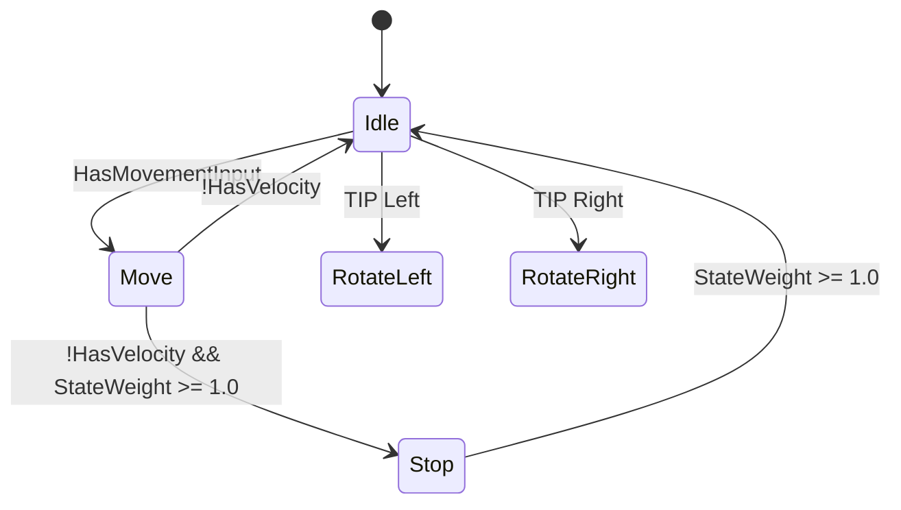

# BlueprintDumpTool — Improvement Milestones

## Current State (v1.0 — Commit 19e210f, 2026-03-03)

### What Works Well
- **AnimBP pose chain walks** — Full backward walk from Root through all anim nodes with correct depth/nesting
- **State machines** — States, transitions with reconstructed boolean rule expressions (recursive resolution up to depth 10), blend type/time/priority, auto-rule flags, state aliases
- **Cached pose chains** — Including orphaned branches not reachable from root walk
- **Interface layers + self-linked layers + monolithic AnimBP support**
- **Blueprint exec chain walking** — Event graphs, functions, branches, switches with per-branch visited sets (no false cycles)
- **Expression resolution** — Recursive for operators/pure nodes (depth 4 for data pins, depth 10 for transitions), BP enum display name fallback
- **Plugin path normalization** — Handles /All/, /Plugins/ prefixes, .AssetName suffixes
- **Thread Safe Update functions** — Fully captured when implemented in Blueprint (proven on GASP: 700+ lines of function bodies, branches, data flow). Empty for C++-only projects (ALS) — this is correct behavior, not a gap.

### Validated On
- **ALS Refactored** — 24 dump files (10 AnimBPs, 4 Blueprints, monolithic + segmented). All structures captured. Empty function sections are correct — ALS logic lives in C++ (`AlsAnimationInstance`).
- **GASP** — Full dump with thread-safe functions, chooser references, complex transition rules. ~700 lines of blueprint logic captured including `BlueprintThreadSafeUpdateAnimation`, `Update_Logic`, `Update_EssentialValues`, etc.
- **Project Summoning** — Own project AnimBPs and Blueprints.

---

## Architecture Insight: C++ vs Blueprint Logic Split

Understanding why some dumps show rich function bodies and others show empty sections:

| Project | Thread Safe Logic | AnimBP Functions | Plugin Captures |
|---------|------------------|-----------------|-----------------|
| **GASP** | Blueprint (`BlueprintThreadSafeUpdateAnimation`) | Full implementations in BP | Everything — complete function bodies with data flow |
| **ALS Refactored** | C++ (`NativeThreadSafeUpdateAnimation`) | None — all in `AlsAnimationInstance.cpp` | Structure only — correct, C++ not dumpable from BP |
| **KLS** | Mixed — C++ base + BP overrides | Some BP functions | Partial — captures BP parts, C++ invisible |

**Key**: The plugin captures 100% of what exists on the Blueprint/AnimBP side. Projects that put logic in C++ will always have less visible in dumps. This is architectural, not a plugin limitation.

---

## Milestone 1: Data Pin Source Wiring (HIGHEST PRIORITY — #1)

### Problem
Anim nodes and BP function nodes have data pins (colored wires — float, bool, enum, struct) that drive behavior at runtime. This is the **single biggest gap** in the plugin — proven by side-by-side comparison of GASP dump vs hand-written GASP_Editor_Analysis.md.

**Current state:**
- **Static values**: Captured well (`Alpha=0.750000`, `Play Rate=1.200000`)
- **Simple variable connections**: Captured (`Alpha=ExplorationPlayRate`)
- **Everything else**: Lost — math chains, Property Access paths, function arguments, return values, string literals, boolean operands

### GASP Validation: 5 of 6 Functions NOT Recreatable From Dump Alone

Tested 6 representative GASP functions against hand-written analysis. Results:

| Function | Recreatable? | Blocking Gap |
|----------|-------------|--------------|
| `Update_EssentialValues` | NO | Property Access opaque, Branch condition missing |
| `Get_DynamicPlayRate` | NO | All 4 curve name strings lost, final Lerp formula invisible |
| `Get_MMBlendTime` | NO | All 4 Return values missing, Branch threshold missing |
| `BlueprintThreadSafeUpdateAnimation` | PARTIAL | BooleanAND operands invisible |
| `Update_MotionMatching` | YES | Asset refs + explicit function calls survive well |
| `Update_MovementDirection` | NO | InRange boundaries, Select options, BooleanOR condition all lost |

**Only `Update_MotionMatching` was fully recreatable** — because it uses asset references and explicit named function calls, not math/Property Access chains.

### The 6 Specific Sub-Gaps (ordered by impact)

#### Gap 1.1: Pure Function Arguments (CRITICAL)
```
DUMP:  Return (Return Value=Lerp())
REAL:  Lerp(1.0, Clamp(SafeDivide(Speed2D, Clamp(SpeedCurve, 1.0, 999.0)), Min, Max), AlphaCurve)
```
`SafeDivide()`, `Greater_DoubleDouble()`, `InRange_FloatFloat()`, `Lerp()` — all show the function name but ZERO input arguments. The entire math formula is lost.

**Root cause:** `BuildExpressionFromPin` resolves the OUTPUT pin of a pure node into a function call string, but doesn't recurse into its INPUT pins to show what's being computed.

**Fix:** When encountering a `UK2Node_CallFunction` that's a pure function (no exec pins), recurse into its input pins to build the full expression: `Lerp(A, B, Alpha)` where A/B/Alpha are themselves resolved recursively.

#### Gap 1.2: String Literal Pin Values (CRITICAL)
```
DUMP:  GetCurveValueFromAnimation()    ← appears 4 times identically
REAL:  GetCurveValueFromAnimation("Enable_Warping", AnimTime)
       GetCurveValueFromAnimation("MoveData_Speed", AnimTime)
       GetCurveValueFromAnimation("MaxDynamicPlayRate", AnimTime)
       GetCurveValueFromAnimation("MinDynamicPlayRate", AnimTime)
```
String/Name default values on input pins (curve names, CVar names, socket names, tag names) are not included in function call summaries.

**Root cause:** `GetDataInputSummary` for `UK2Node_CallFunction` currently only shows connected pins and non-default values. String/Name literals that ARE the default value for that specific pin instance (not the AutogeneratedDefaultValue) are being filtered out.

**Fix:** For `UK2Node_CallFunction`, include ALL non-empty string/name input pin values (not just non-default), since these ARE the meaningful parameters. The AutogeneratedDefaultValue filter should not apply to string parameters — an empty string is the default, any non-empty string is user-specified data.

#### Gap 1.3: Return Node Values (CRITICAL)
```
DUMP:  -> Return            (no value)
REAL:  -> Return 0.5        (standard locomotion blend)
```
`Get_MMBlendTime` has 4 returns. All show `Return` with no value. The function's entire purpose is returning specific numbers.

**Root cause:** `WalkExecChain` identifies Return nodes but doesn't read the ReturnValue input pin.

**Fix:** When encountering a Return node, read its `ReturnValue` input pin. If it has a default value, show it: `Return (0.500000)`. If it's connected, resolve with `BuildExpressionFromPin`: `Return (Lerp(1.0, ClampedRate, AlphaCurve))`.

#### Gap 1.4: BooleanAND/BooleanOR Operands (HIGH)
```
DUMP:  Branch (Condition=BooleanAND())
REAL:  Branch (Condition=HasOwningActor && UseThreadSafeUpdateAnimation)
```
Boolean operator nodes show the operator but not WHAT is being combined.

**Root cause:** `BuildExpressionFromPin` handles `BooleanAND` / `BooleanOR` by name but the current implementation may not be resolving their input pins. These are `UK2Node_CommutativeAssociativeBinaryOperator` or similar — need to walk their A/B input pins.

**Fix:** In `BuildExpressionFromPin`, when encountering BooleanAND/BooleanOR, resolve both input operands recursively and join with `&&` / `||`. Already have the operator symbol map — just need to ensure the input pin walk works.

#### Gap 1.5: Property Access Deep Paths (HIGH)
```
DUMP:  Set CharacterTransform = Property Access
REAL:  Set CharacterTransform = CharacterProperties.ActorTransform (thread safe)
```
Property Access nodes read struct member chains but we only show "Property Access" or "Value".

**Root cause:** `GetNodeTitle(FullTitle)` doesn't include the property path on a second line for AnimBP Property Access nodes. The actual path is stored internally in the node's `PropertyAccess` member.

**Fix:** Add `PropertyAccessNode` module dependency to `Build.cs`. Cast to `UK2Node_PropertyAccess` (or the AnimGraph equivalent) and read the `Path` / `ResolvedPinPath` property directly. Fallback to current "Value" behavior if cast fails.

#### Gap 1.6: Branch Condition Sources (MEDIUM)
```
DUMP:  Branch (Condition=MovementState == Moving)     ← this works!
DUMP:  Branch                                          ← but this is empty
```
Some Branch nodes show their condition (when wired to a simple expression). Others show nothing (when the condition pin wiring is complex or uses a cached variable).

**Root cause:** `WalkExecChain` reads the Branch node's Condition pin via `GetDataInputSummary`, but when the condition comes from a multi-hop chain, the summary may be empty.

**Fix:** Always resolve the Condition pin of Branch nodes through `BuildExpressionFromPin` (depth 4). If the result is non-empty, show it. This already partially works for some cases — need to make it consistent.

### Implementation Priority Within M1

1. **Gap 1.3 (Return values)** — Easiest fix, huge payoff. One pin read on Return nodes.
2. **Gap 1.2 (String literals)** — Change filter logic for string/name pins. Moderate effort.
3. **Gap 1.1 (Pure function args)** — Recursive input pin resolution. Medium effort, biggest single improvement.
4. **Gap 1.4 (Boolean operands)** — Verify BuildExpressionFromPin handles these; likely small fix.
5. **Gap 1.6 (Branch conditions)** — Ensure consistent Condition pin resolution. Small fix.
6. **Gap 1.5 (Property Access paths)** — Needs module dependency research. Medium effort.

### Impact
Fixing gaps 1.1-1.4 alone would make **4 of 5 previously non-recreatable GASP functions recreatable from dump output**. This changes the plugin from "structural skeleton" to "functional specification" — the difference between a map of a building and a blueprint with dimensions.

### Evidence: What Already Works (and why)
`Update_MotionMatching` was fully recreatable because it uses:
- Asset references (Chooser names survive as string properties on nodes)
- Explicit `UK2Node_CallFunction` calls (function names + named output pins survive)
- Direct variable SETs (target variable names survive)

These patterns work because they're node-level properties, not pin-level data flow. The fix is extending the same resolution quality to pin-level connections.

---

## Milestone 2: Batch Dump + File Output (HIGH PRIORITY)

### Problem
Currently one asset at a time via console command. Dumping an entire project requires manual repetition.

### Proposed Commands
```
ScanProject /Game/                      → Discovery scan ONLY — lists all assets, shows what's supported
DumpProject /Game/                      → Full dump (scan + dump all supported assets)
DumpAllAnimBPs /Game/Characters/        → Dumps every AnimBP in folder (recursive)
DumpAllBPs /Game/Characters/            → Dumps every Blueprint in folder (recursive)
```

### Step 1: Asset Discovery Manifest (scan before dump)

Before dumping anything, scan the folder and produce a **manifest** listing EVERY asset found, grouped by type, with clear markers for what we support vs what we skip. This serves two purposes:
1. User sees exactly what will be dumped and what won't
2. We see what asset types exist that we don't support yet — drives future milestones

**Example output:**
```
=== Project Scan: /Game/Characters/ ===
Found 47 assets in 12 folders

SUPPORTED (will dump):
  AnimBlueprint (6):
    /Game/Characters/Animation/ABP_Hero
    /Game/Characters/Animation/ABP_Hero_Overlay
    /Game/Characters/Animation/ABP_Camera
    /Game/Characters/Animation/ABP_Enemy_Base
    /Game/Characters/Animation/ABP_Enemy_Melee
    /Game/Characters/Animation/ABP_Enemy_Ranged
  Blueprint (4):
    /Game/Characters/BP_HeroCharacter
    /Game/Characters/BP_EnemyBase
    /Game/Characters/Abilities/BP_DashAbility
    /Game/Characters/Abilities/BP_BlockAbility

NOT YET SUPPORTED (skipped):
  AnimationSequence (18):
    /Game/Characters/Animation/Locomotion/A_Run_Fwd
    /Game/Characters/Animation/Locomotion/A_Run_Bwd
    ... (16 more)
  BlendSpace (5):
    /Game/Characters/Animation/BS_WalkRun_Fwd
    ... (4 more)
  BlendSpace1D (2):
    /Game/Characters/Animation/BS1D_Lean
    /Game/Characters/Animation/BS1D_AimOffset
  ChooserTable (3):
    /Game/Characters/Animation/Choosers/CT_Locomotion
    /Game/Characters/Animation/Choosers/CT_Starts
    /Game/Characters/Animation/Choosers/CT_Stops
  AnimMontage (7):
    /Game/Characters/Animation/Montages/AM_Attack_Light
    ... (6 more)
  ControlRigBlueprint (1):
    /Game/Characters/Animation/CR_FootIK
  PoseSearchDatabase (2):
    /Game/Characters/Animation/MM/PSD_Locomotion
    /Game/Characters/Animation/MM/PSD_Stops
  Skeleton (1):
    /Game/Characters/Meshes/SK_Hero
  SkeletalMesh (1):
    /Game/Characters/Meshes/SKM_Hero
  PhysicsAsset (1):
    /Game/Characters/Meshes/PA_Hero
  BlendProfile (1):
    /Game/Characters/Animation/BP_UpperBody
  Other (1):
    /Game/Characters/Animation/CurveTable_Locomotion (CurveTable)

SUMMARY: 10/47 assets will be dumped (6 AnimBP + 4 BP)
         37 assets skipped (18 AnimSeq, 7 BlendSpace, 3 Chooser, 7 Montage, 2 other)
```

This manifest immediately shows:
- **18 AnimationSequences** — that's M4 territory. Lots of animation data we're missing.
- **7 BlendSpaces** — M5. Axes and samples invisible.
- **3 ChooserTables** — M6. Motion Matching selection logic invisible.
- **7 AnimMontages** — future milestone. Combat/ability logic invisible.
- **1 ControlRigBlueprint** — future. IK setup invisible.
- **2 PoseSearchDatabases** — future. MM database contents invisible.

### Step 2: Dump Supported Assets

After manifest, dump all supported assets using existing `DumpAnimBP`/`DumpBlueprint` logic.

### Output Options
- Individual files (current behavior, one per asset)
- Combined file with table of contents
- Summary mode (structure only, no state details) vs full mode
- Manifest-only mode (`ScanProject` — no dumping, just the discovery report)

### Implementation
Use `FAssetRegistryModule` to enumerate ALL assets in a content path. Group by `UClass`:
- `UAnimBlueprint` → dump with `FAnimBPDumper`
- `UBlueprint` → dump with `FBlueprintDumper`
- Everything else → list in "NOT YET SUPPORTED" with class name and count

As we add new dumpers (M4: AnimSequence, M5: BlendSpace, M6: Chooser), they plug into the same scan loop — assets move from "NOT YET SUPPORTED" to "SUPPORTED" automatically.

### Impact
- Enables project-wide analysis in one command
- Foundation for cross-referencing (M8)
- **Self-documenting roadmap**: the manifest tells us exactly which asset types matter for each project, sorted by count. 18 AnimSequences > 3 ChooserTables — confirms M4 before M6 is the right priority.
- Users see immediately what they're getting and what they're missing — transparent about plugin capabilities

---

## Milestone 3: JSON Output Mode (HIGH PRIORITY)

### Problem
Plain text is human-readable but not queryable. Can't diff, search programmatically, or feed to tools efficiently.

### Proposed Approach
Add `--json` flag to existing commands:
```
DumpAnimBP /Game/Path/ABP --json
```

### JSON Structure
```json
{
  "type": "AnimBP",
  "name": "AB_Als_Standing",
  "skeleton": "SK_Als",
  "parentClass": "AlsLinkedAnimationInstance",
  "graphs": ["AnimGraph", "EventGraph"],
  "animGraph": {
    "poseChain": {
      "node": "OutputPose",
      "children": [
        {
          "node": "RefreshRotateInPlace",
          "type": "ThreadSafeUpdateFunction",
          "children": [...]
        }
      ]
    },
    "stateMachines": [{
      "name": "Standing States",
      "entryState": "Idle",
      "states": [...],
      "transitions": [{
        "from": "Idle",
        "to": "Move",
        "condition": "False",
        "blendType": "Standard",
        "blendTime": 0.20,
        "priority": 1
      }]
    }],
    "cachedPoses": [...]
  },
  "functions": [...],
  "eventGraph": [...]
}
```

### Impact
Enables: programmatic diffing, cross-reference building, LLM-optimized context feeding, custom visualization tools, CI/CD integration (detect AnimBP regressions).

---

## Milestone 4: Animation Sequence Metadata (MEDIUM PRIORITY)

### Problem
Dumps show `Sequence Player 'A_Als_Sprint'` but nothing about the animation itself.

### What to Capture
| Property | Why It Matters |
|----------|---------------|
| Duration (seconds) | Understanding timing, gate thresholds, blend windows |
| Root motion (yes/no + type) | Fundamental architectural decision per animation |
| Additive type (None/Local/Mesh) | Determines how animation stacks |
| Curves present (list names) | Distance curves, enable_warping, foot sync — critical for locomotion |
| Sync markers (list names) | Foot plant timing for sync groups |
| Notify events (list) | AnimNotify triggers that drive state changes |
| Loop flag | Whether animation is designed to repeat |

### Proposed Commands
```
DumpAnim /Game/Animations/A_Als_Sprint          → Single animation details
DumpAnimFolder /Game/Animations/Locomotion/     → All animations in folder
```

### Inline Enhancement
When dumping AnimBP, optionally append metadata inline:
```
Sequence Player 'A_Als_Sprint' (3.2s, Loop, RootMotion, Curves:[Distance,FootPlant_L,FootPlant_R])
```

### Impact
Knowing animation duration, curves, and root motion status is essential for understanding timing relationships between states. Currently requires opening each animation individually in the editor.

---

## Milestone 5: Blend Space Details (MEDIUM PRIORITY)

### Problem
`Blendspace Player 'BS_Als_WalkRun_Forward'` — what are the axes? What sample points? This is critical context for locomotion.

### What to Capture
| Property | Example |
|----------|---------|
| Axis X name + range | Speed (0 → 600) |
| Axis Y name + range | Direction (-180 → 180) |
| Sample count | 9 samples |
| Sample list | (0,0)=Idle, (150,0)=Walk_Fwd, (350,0)=Run_Fwd, ... |
| Interpolation type | Weighted average |
| Target weight interpolation | Per axis (speed 3.0, direction 6.0) |

### Proposed Command
```
DumpBlendSpace /Game/Animation/BS_Als_WalkRun_Forward
```

### Impact
Axes and sample points reveal the blending topology. Speed breakpoints tell you walk→run thresholds. Direction samples show how many directions are blended.

---

## Milestone 6: Chooser Table Dumping (MEDIUM-HIGH PRIORITY)

### Problem
GASP and UE5.4+ Motion Matching projects use Chooser Tables for animation selection. These are `UChooserTable` data assets — NOT AnimBPs or Blueprints. The plugin can't touch them.

### What to Capture
| Property | Why It Matters |
|----------|---------------|
| Columns (parameters) | What inputs drive selection (Speed, Gait, Direction, etc.) |
| Column types | Float range, Enum, Bool, GameplayTag |
| Rows (results) | Which animation/asset each row selects |
| Row conditions | Value ranges/matches that trigger each row |
| Output type | What the chooser returns (AnimSequence, Montage, etc.) |

### Proposed Command
```
DumpChooser /Game/Animation/ChooserTables/CT_Locomotion
DumpAllChoosers /Game/Animation/ChooserTables/
```

### Implementation Notes
`UChooserTable` is in the `Chooser` module (UE5.4+). Need to add module dependency. The table structure is column-based with `FChooserColumnBase` subclasses. Rows are evaluated top-to-bottom with first-match semantics.

### Impact
Critical for understanding ANY Motion Matching project. Without Chooser Table dumps, the animation selection logic is invisible. GASP references choosers heavily (`SetBlendStackAnimFromChooser`).

---

## Milestone 7: Reroute Node Collapse (LOW PRIORITY, EASY)

### Problem
Visual-only routing nodes add noise:
```
\-- Reroute Node
  \-- Reroute Node
    \-- Reroute Node
      \-- Reroute Node
        \-- Layered blend per bone
```

### Proposed Fix
Option to skip Reroute Nodes in pose chain output. Already handled correctly in `BuildExpressionFromPin` (walks through them). Apply same pattern in `WalkPoseChain`.

### Impact
Cleaner output, especially for AB_Als_Layering which has 4-deep reroute chains. Minor improvement.

---

## Milestone 8: Cross-Reference Index (LOW PRIORITY, needs M2+M3)

### Problem
"Which AnimBPs reference animation X?" requires manual grep across dump files.

### Proposed Feature
After batch dump (M2) with JSON output (M3), generate a cross-reference index:

```json
{
  "animations": {
    "A_Als_Sprint": {
      "usedIn": ["AB_Als_Standing:MovementStates:MoveForward", "AB_Als_Monolithic:Standing:Move"],
      "asType": ["SequencePlayer", "SequenceEvaluator"]
    }
  },
  "cachedPoses": {
    "Movement": {
      "savedIn": "AB_Als_Standing:AnimGraph",
      "usedIn": ["AB_Als_Standing:StandingStates:Move", "AB_Als_Standing:StopStates:Entry", ...]
    }
  },
  "blendSpaces": {...},
  "montageSlots": {...}
}
```

### Impact
Answers questions like: "What would break if I delete A_Als_Sprint?" and "Where is cached pose 'Movement' consumed?"

---

## Milestone 9: Mermaid State Machine Diagrams (LOW PRIORITY, needs M3)

### Problem
State machine text dumps are hard to visualize for complex SMs with many transitions.

### Proposed Feature
Generate Mermaid-compatible diagrams from JSON output:



### Impact
Visual state machine exploration. Useful for documentation and onboarding.

---

## Milestone 10: Semantic Compression for LLM Context (FUTURE)

### Problem
The 8 ALS overlay AnimBPs (Default, Feminine, Masculine, Injured, HandsTied, Barrel, Box, Torch) all follow the same pattern. 400+ lines of near-identical structure.

### Proposed Feature
Detect repeated patterns and output template + variations:

```
=== Overlay Template (used by: Default, Feminine, Masculine, Barrel, Box) ===
Blend Poses by Gameplay Tag
  [Default] → Apply Additive (Alpha=VAR) + Blend Multi pose selection
  [Mantling] → ...
  [Rolling] → ...

Variations:
  Default:   Alpha=0.750, Poses='A_Als_Default_Poses'
  Feminine:  Alpha=0.500, Poses='A_Als_Feminine_Poses'
  Masculine: Alpha=1.000, Poses='A_Als_Masculine_Poses'
```

### Impact
Massive context window savings when feeding dumps to LLMs. 8 files compressed to ~20% of original size.

---

## Milestone 11: Validation / Analysis Mode (FUTURE)

### Proposed Checks
- **Unreachable states** — states with no incoming transitions (except entry)
- **Missing return transitions** — A→B exists but B→A doesn't (possible trap state)
- **Duplicate transition rules** — same source→target with same condition
- **Animation coverage** — states without animation players (empty states)
- **Transition completeness** — states with only one exit path
- **Curve usage audit** — Modify Curve nodes referencing curves that don't exist on skeleton

### Impact
Catches common AnimBP authoring mistakes. Useful for QA and review.

---

## Milestone 12: UE5 Version Compatibility (MEDIUM PRIORITY)

### Current State
Plugin is built for UE 5.7.3 (Project Summoning's engine version). However, it **already works on UE 5.5.1** — tested successfully with ALS Refactored. UE shows a "plugin was built for a different engine version, expect problems" warning, but no actual problems observed.

### Why It Works Across Versions
The plugin uses editor-only APIs that are stable across UE5 versions:
- `UEdGraph`, `UEdGraphPin`, `UEdGraphNode` — core graph infrastructure, stable since UE4
- `UAnimGraphNode_Root`, `UAnimGraphNode_StateMachine`, `UAnimStateNode` — AnimGraph editor nodes, stable across UE5
- `UK2Node_CallFunction`, `UK2Node_VariableGet` — Kismet/Blueprint graph nodes, very stable
- `FPoseLinkBase::StaticStruct()` — engine-level struct, unlikely to change

### Known Risk Areas
These APIs are more version-sensitive and could break on older UE5 versions:

| API | Risk | Affected Feature | First Available |
|-----|------|-----------------|----------------|
| `UAnimStateAliasNode` | Medium | State alias detection (M0 Gap 3) | UE5.0+ (but class may differ) |
| `GetDisplayNameTextByValue` | Low | BP enum display names | UE4.26+ |
| `PropertyAccessNode` APIs | High | Property Access paths (M1 Gap 1.5) | UE5.1+ |
| `UChooserTable` | High | Chooser Table dumping (M6) | UE5.4+ |
| `BlendStack` node types | High | Future Blend Stack support | UE5.4+ |
| Thread Safe anim functions | Low | Function graph detection | UE5.0+ |

### Proposed Approach

**Phase 1: Document + Defensive Guards (Low effort)**
- Add `#if ENGINE_MAJOR_VERSION == 5 && ENGINE_MINOR_VERSION >= X` guards around version-sensitive code
- Graceful fallback when a feature isn't available (skip state aliases on UE5.3, skip Chooser dumping on UE5.3, etc.)
- Update `.uplugin` to declare supported engine versions explicitly

**Phase 2: Test Matrix (Medium effort)**
- Test on UE 5.4, 5.5, 5.6, 5.7 with representative projects
- Document which features work on which version
- Identify actual breakages (not just warnings) and add version guards

**Phase 3: Multi-Version Release (Low effort if Phase 1-2 done)**
- Separate plugin releases per engine version, or single release with version guards
- README documents compatibility matrix
- Can claim "UE 5.4 - 5.7+ compatible" on Marketplace/GitHub

### Version Compatibility Matrix (Target)

| Feature | 5.3 | 5.4 | 5.5 | 5.6 | 5.7 |
|---------|-----|-----|-----|-----|-----|
| AnimBP pose chains | Y | Y | Y | Y | Y |
| State machines + transitions | Y | Y | Y | Y | Y |
| Blueprint exec chains | Y | Y | Y | Y | Y |
| Cached pose orphan detection | Y | Y | Y | Y | Y |
| State aliases | ? | Y | Y | Y | Y |
| Chooser Tables (M6) | - | Y | Y | Y | Y |
| Blend Stack internals | - | ? | ? | Y | Y |
| Property Access paths (M1) | ? | Y | Y | Y | Y |

`Y` = works, `?` = needs testing, `-` = feature doesn't exist in that version.

### Impact
Makes the plugin a **drop-in tool for any UE5 project**, not just 5.7. Broadens audience significantly if released publicly. The core graph-walking code is version-agnostic — only specific node type handling needs guards.

---

## Milestone 13: Content Browser Right-Click Menu + Reference Chain (MEDIUM PRIORITY)

### Problem
Console commands require knowing the asset path. Most users work visually in the Content Browser — they see an AnimBP, want to dump it, and shouldn't need to copy-paste a path.

### Feature: Right-Click "Dump Asset"

Right-click any supported asset in Content Browser → **"Dump Asset (BlueprintDumpTool)"** menu entry.

```
[Content Browser: right-click on ABP_Hero]
  ├── Edit...
  ├── Rename
  ├── Duplicate
  ├── ...
  ├── ─────────────────────
  ├── Dump Asset (BlueprintDumpTool)     ← NEW
  └── ...
```

Clicking it runs the appropriate dumper (AnimBP or Blueprint) and opens the output file or shows a notification with the path.

### Implementation — UE5 UToolMenus API

UE5's modern menu system uses `UToolMenus`. Register a Content Browser context menu extension:

```cpp
// In Module StartupModule():
UToolMenus::RegisterStartupCallback(FSimpleMulticastDelegate::FDelegate::CreateLambda([]()
{
    UToolMenu* Menu = UToolMenus::Get()->ExtendMenu("ContentBrowser.AssetContextMenu");
    FToolMenuSection& Section = Menu->FindOrAddSection("AssetContextMenu.BlueprintDumpTool");
    Section.AddDynamicEntry("BlueprintDumpTool", FNewToolMenuSectionDelegate::CreateLambda(
        [](FToolMenuSection& InSection)
        {
            // Get selected assets from context
            UContentBrowserAssetContextMenuContext* Context =
                InSection.FindContext<UContentBrowserAssetContextMenuContext>();
            if (!Context) return;

            // Check if any selected asset is a supported type
            bool bHasSupported = false;
            for (const FAssetData& Asset : Context->SelectedAssets)
            {
                if (Asset.AssetClassPath == UAnimBlueprint::StaticClass()->GetClassPathName() ||
                    Asset.AssetClassPath == UBlueprint::StaticClass()->GetClassPathName())
                {
                    bHasSupported = true;
                    break;
                }
            }

            if (bHasSupported)
            {
                InSection.AddMenuEntry(
                    "DumpAsset",
                    LOCTEXT("DumpAsset", "Dump Asset (BlueprintDumpTool)"),
                    LOCTEXT("DumpAssetTooltip", "Dump this asset's structure to a text file"),
                    FSlateIcon(),
                    FToolMenuExecuteAction::CreateLambda([Context](const FToolMenuContext&)
                    {
                        for (const FAssetData& Asset : Context->SelectedAssets)
                        {
                            // Call existing dump logic with asset path
                            FString Path = Asset.GetObjectPathString();
                            // ... dispatch to FAnimBPDumper or FBlueprintDumper
                        }
                    })
                );
            }
        }
    ));
}));
```

The actual API may vary slightly — `UContentBrowserAssetContextMenuContext` is the UE5.1+ approach. Older: `FContentBrowserModule::AddAssetViewContextMenuExtender`. Both are well-documented.

### Feature: Reference Chain Suggestion (Phase 2)

After dumping an asset, query its references and offer to dump connected assets too.

**UE5 Asset Registry API:**
```cpp
FAssetRegistryModule& AssetRegistryModule = FModuleManager::LoadModuleChecked<FAssetRegistryModule>("AssetRegistry");
IAssetRegistry& AssetRegistry = AssetRegistryModule.Get();

TArray<FAssetIdentifier> Dependencies;
AssetRegistry.GetDependencies(AssetData.PackageName, Dependencies);
```

This returns ALL assets the dumped asset references — AnimSequences it plays, BlendSpaces it samples, other AnimBPs it links to, Skeletons, etc.

**Workflow:**

```
[User right-clicks ABP_Hero → "Dump Asset (BlueprintDumpTool)"]

Dumping ABP_Hero... Done! Saved to Saved/AnimBPDumps/ABP_Hero_Dump.txt

This asset references 23 other assets:
  SUPPORTED (can dump now):
    AnimBlueprint (2):  ABP_Hero_Overlay, ABP_Camera
    Blueprint (1):      BP_HeroCharacter

  NOT YET SUPPORTED (listed for reference):
    AnimSequence (12):  A_Idle, A_Run_Fwd, A_Run_Bwd, ...
    BlendSpace (4):     BS_WalkRun_Fwd, BS_WalkRun_Bwd, ...
    AnimMontage (3):    AM_Attack_Light, AM_Dodge, AM_TurnInPlace_90
    Skeleton (1):       SK_Hero

  [Dump 3 supported references?] [Yes] [No] [Select individually...]
```

If the user clicks **Yes**, it dumps ABP_Hero_Overlay, ABP_Camera, and BP_HeroCharacter too. If they click **Select individually**, a checklist dialog appears.

As we add new dumpers (M4-M6), more referenced assets move to the "SUPPORTED" section automatically — same pattern as the batch scan manifest (M2).

**The reference chain is recursive** — after dumping ABP_Hero_Overlay, it might reference AB_Hero_Overlay_Rifle, which references more AnimSequences. Each hop offers the same prompt. In practice, 2-3 hops covers an entire character's animation system.

### Implementation Phases

**Phase 1: Right-click menu (Low effort)**
- Register `UToolMenus` extension in `StartupModule`
- Filter for supported asset classes (AnimBlueprint, Blueprint)
- Call existing dump logic
- Show editor notification with output path

**Phase 2: Reference chain dialog (Medium effort)**
- Query `IAssetRegistry::GetDependencies` after dump
- Filter + group by class
- Show dialog with supported/unsupported split
- Batch dump selected references
- Optional: recursive chain with depth limit (default 2 hops)

**Phase 3: Multi-select support (Low effort)**
- Select multiple assets in Content Browser → right-click → dump all
- Combined manifest showing total asset count + references

### Impact
- **Zero-friction workflow** — see asset, right-click, get dump. No path memorization.
- **Reference chain = guided project exploration** — dump one AnimBP, discover its entire connected graph
- **Natural discovery of unsupported types** — users see "12 AnimSequences referenced but not yet dumpable" and understand what's coming
- **Complements batch dump (M2)** — batch is for "dump everything", right-click is for "dump this one thing and what it touches"

---

## Priority Ordering

| Priority | Milestone | Effort | Impact | Validation |
|----------|-----------|--------|--------|------------|
| **1** | **M1: Data pin wiring** | **Medium-High** | **HIGHEST — makes dumps recreatable** | **5/6 GASP functions currently fail without this** |
| 2 | M2: Batch dump + scan manifest | Low-Medium | High — enables everything else | Self-documenting roadmap |
| 3 | M13: Right-click menu + ref chain | Low-Medium | High — zero-friction UX | Phase 1 easy, Phase 2 medium |
| 4 | M3: JSON output | Medium | High — foundation for tooling | Enables M8, M9 |
| 5 | M4: Animation metadata | Low-Medium | Medium-High — essential context | Duration/curves/root motion |
| 6 | M6: Chooser Tables | Medium | High for UE5.4+ projects | GASP uses heavily |
| 7 | M12: UE5 version compat | Low-Medium | High — broadens audience | Already works on 5.5.1, needs guards |
| 8 | M5: Blend Space details | Low | Medium — important for locomotion | Axis config critical |
| 9 | M7: Reroute collapse | Very Low | Low — cosmetic cleanup | AB_Als_Layering noise |
| 10 | M8: Cross-reference | Low (if M2+M3 done) | Medium | Needs M2+M3 first |
| 11 | M9: Mermaid diagrams | Low (if M3 done) | Medium — great for docs | Needs M3 first |
| 12 | M10: Semantic compression | Medium | Medium — LLM context savings | 8 ALS overlays → template |
| 13 | M11: Validation | Medium | Medium — QA tool | Catches authoring mistakes |

**M1 is #1 because:** Every other milestone adds more assets or better formatting to the dump. Only M1 fixes the fundamental data quality — making function dumps go from "structural skeleton" to "functional specification." Without M1, a batch dump (M2) of JSON (M3) still produces non-recreatable function descriptions.

**M13 at #3 because:** Right-click dump is the most natural UX for single-asset exploration — users work in Content Browser, not console. Phase 1 (just the menu entry) is very low effort. The reference chain (Phase 2) is the killer feature: dump one AnimBP, discover its entire animation ecosystem. Pairs perfectly with M2's scan manifest — batch for whole-project, right-click for targeted exploration.

**M12 at #7 because:** The plugin already works cross-version — just needs defensive guards and testing. High payoff for low effort, but doesn't block any other milestone. Best done alongside or after M1-M3 when the core features are mature enough to release.

---

## Completed Improvements (Changelog)

### Commit 1acb266 — Fix 4 Data Gaps
- Recursive expression resolution in `GetDataInputSummary` (depth 4 for data pins)
- Moved `BuildExpressionFromPin` + helpers to shared `BlueprintDumpUtils`
- BP enum display names (`GetDisplayNameTextByValue` fallback)
- State alias detection in state machines
- Plugin asset path normalization (`/All/`, `/Plugins/` prefix stripping)

### Commit d2e8aaf — NewEnumerator + Monolithic Layers
- Fix NewEnumerator display names for BP-defined enums
- Fix Set-node enum value resolution
- Monolithic AnimBP self-linked layer function graph dumping

### Commit 19e210f — Cached Poses + Cycles + Property Access
- Property Access node handling (FullTitle → pin name fallback)
- Orphaned cached pose chain dumping (`DumpUnvisitedCachedPoses`)
- Per-branch visited sets in exec chain walker (eliminates false cycles)

---

## Validation Methodology

### GASP Side-by-Side Comparison (2026-03-03)

Compared 6 GASP functions as they appear in:
- **Plugin dump**: `GASP_Dumps/SandboxCharacter_CMC_ABP_Dump.txt`
- **Manual analysis**: `analysis/GASP_Editor_Analysis.md` (6,047 lines, hand-written from editor screenshots)

**What the dump captures well (structural skeleton):**
- Control flow topology — Sequence order, Branch/True/False, Switch cases, nested branches
- Variable names on SET operations — target always named, simple sources preserved
- Asset references — Chooser names, blendspace names, enum type names
- Function call names — which functions are called and with what named parameters
- State machine transitions — every transition with condition, blend type/time, priority

**What the dump loses (data flow):**
- Property Access paths → shows "Property Access" or "Value", not actual struct member chain
- Pure function arguments → `Lerp()`, `SafeDivide()`, `InRange_FloatFloat()` with no inputs visible
- String literal parameters → curve names, CVar names, tag names inside function calls
- Return values → `Return` with no value on pure-purpose functions like `Get_MMBlendTime`
- Boolean operands → `BooleanAND()` / `BooleanOR()` without showing what's being combined
- Developer comments → zero captured (manual analysis has dozens)
- Design rationale and cross-references → each function presented in isolation

**Recreatability score: 1/6 functions fully recreatable from dump alone.**
Target after M1 completion: 5/6 functions recreatable (Property Access paths may remain partial).

### ALS Architecture Validation (2026-03-03)

Cross-referenced ALS dump files against ALS-Refactored C++ source (146 files, 18,137 lines):
- Confirmed empty function sections are correct — ALL logic in `AlsAnimationInstance.cpp` (2016 lines)
- C++ computes 40+ state struct members (`FAlsLocomotionAnimationState`, `FAlsGroundedState`, `FAlsStandingState`, `FAlsTurnInPlaceState`, `FAlsFeetState`, `FAlsLayeringState`, etc.)
- AnimBP reads these as `BlueprintReadOnly` properties via Property Access / variable nodes
- Thread Safe functions (`RefreshGroundedMovement`, `RefreshTurnInPlace`, etc.) are `BlueprintCallable` C++ — called FROM AnimBP nodes in the pose chain but logic executes in C++
- 15 custom Control Rig units + 2 custom anim nodes (CurvesBlend, GameplayTagsBlend) — runtime-only, not dumpable
- Plugin correctly captures 100% of the BP-side structure. The "missing" data is C++.
